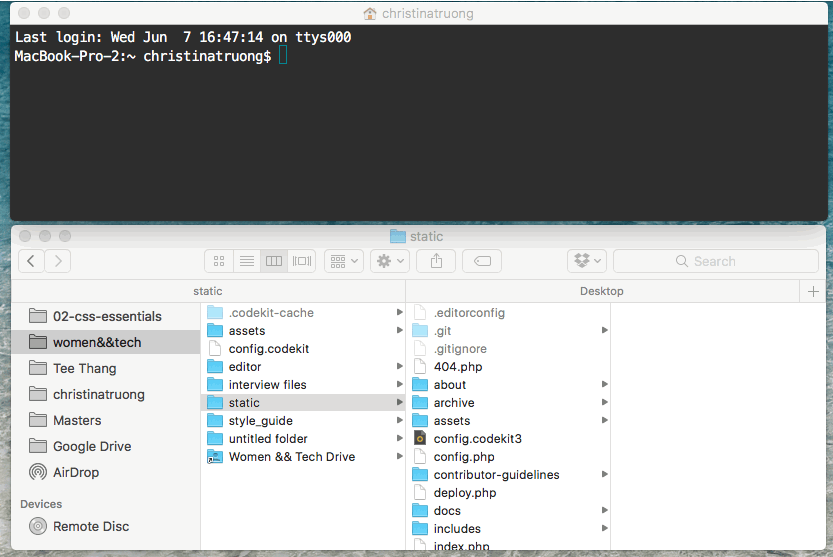
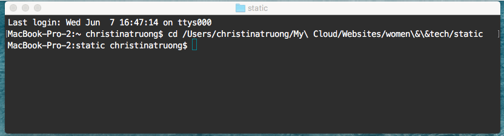

# Women&&Tech

This repo contains the project files for <http://womenandtech.com>. These files are only for content updates and adding new interviews. If changes to the site structure, overall design, CSS or JavaScript are required, they should be updated in the [Style Guide repo](https://github.com/WomenAndTech/style_guide), which contains all the development files. View the repo for more information about making global changes.

<br>

## Table of contents
- [Style Guide](#style-guide)
- [Github Workflow](#github-workflow)
  - [Intro to Git and Github](docs/git-intro.md)
  - [Using Github with SourceTree](docs/git-sourcetree.md)
  - [Using Github with the Command Line](docs/git-command-line.md) [in progress]
- [Local Development Setup](#local-development-setup)
- [File Naming and Structure](#file-naming-and-structure)
- [Adding Content (Interviews, Pages, Home Page and Archives)](#adding-content)
- [Consistent Code Styles](#consistent-code-styles)
- [Auto Deploy and Updating the Live Site](#auto-deploy-updates)

<br>

## Style guide

The [Style Guide](http://womenandtech.github.io/style_guide/) is a reference for adding content to the site. It contains content module examples, style patterns, code snippets and page templates. Each module was created to work as a standalone component. Add modules as needed to build the page content with consistent designs.

View the repo for more info: <https://github.com/WomenAndTech/style_guide>

<br>

## Github Workflow

You can use whatever tool or app you prefer to manage Git and Github. Just be sure to follow these steps and the other guidelines listed in this doc.

To update the website content, follow these steps:

1. Clone this repo to create your own copy.
2. Create a new branch from `master` for **each** interview, content update or feature.
3. Add all your updates to your branch and test it.
4. Merge your branch to `master` by sending a pull request. If you would like someone to test your changes before going live, leave a comment, with their username, in the pull request.
5. Accept the pull request. This will add your changes to the `master` branch and will **automatically push your changes live** to womenandtech.com.
6. Delete the branch after your updates are complete.


### Git & Github Documentation

For more details about using Git and Github, check out these guides:

* [Intro to Git and Github](docs/git-intro.md)
* [Using Github with SourceTree](docs/git-sourcetree.md)
* [Using Github with the Command Line](docs/git-command-line.md) [in progress]

<br>

## Local Development Setup

PHP files are used for basic templating and customization. Unlike HTML files, PHP must run on a local server to be viewed in the browser.

### Running a Local Server

There are different apps and tools for running a local server but use Python's SimpleHTTPServer module to get a basic server up and running quickly.

For Windows users, you must install Python first. Instructions can be found [here](https://developer.mozilla.org/en-US/docs/Learn/Common_questions/set_up_a_local_testing_server). For Mac users, Python comes pre-installed. To run a local server, follow the instructions below.

**Step 1:** 

Open **Terminal** and use the *change directory* command to navigate to your project folder. Type `cd`, space, then the entire file path or use the shortcut and drag your folder into Terminal. Then press enter.

```
cd /Users/username/path/to/static-site
```
**Shortcut:** Drag your folder into Terminal to add the file directory path


  
<br>

**Step 2:**

Run the following command in Terminal to start your local server.
```
php -S localhost:8000
```

You can now view the site locally, in your browser, using  <http://localhost:8000>.




If you choose to use any tools or software such as Codekit, Mamp, Grunt or Gulp to run a local server, don't save any files generated from these tools into the main repo (e.g. config files). We're trying to reduce the number of dependencies on specific tools to make it flexible for different workflow preferences.

<br>

## File Naming and Structure
It's important to follow these naming conventions and the file structure because parts of the site architecture depend on it.

<br>

### Pages
For non-interview pages (i.e. About), create a folder and name it the way you want it to appear in the URL. For example, to create the url: `womenadtech.com/about/`, name the folder "about". Then add your content in an `index.php` file. 

```
static-site/
├── about/
│   ├── index.php
└── interview/
    ├── firstname-lastname/
          └── index.php
```

<br>

### Interviews
Save all interviews within the **`interview`** folder. Create a new folder for the interviewee, using their name. Create an `index.php` file, following the structure below, to add the interview content.

```
interview/firstname-lastname/index.php
```

#### Interview Images
Save all images within the `assets/img` folder.

To indicate the type of image used, name the file with a specific prefix (featured, landscape, portrait, left, right) followed by the name of the interviewee. Refer to the [style guide](http://womenandtech.github.io/style_guide) for examples of the image options and code snippets.

```
assets/img/featured-firstname-lastname.jpg
assets/img/landscape-firstname-lastname.jpg
assets/img/portrait-firstname-lastname.jpg
assets/img/left-firstname-lastname.jpg
assets/img/right-firstname-lastname.jpg
```

Note that there should only be one "featured" image per interview. If there are multiple images for the other image types, add a descriptive word or short phrase to the end of the file name.

```
assets/img/portrait-first-lastname.jpg
assets/img/portrait-first-lastname-with-dog.jpg
```

#### Interview Archives
The **Latest Interview** cards & archive page both use the same thumbnail image. Use this naming convention:
```
assets/img/thumbnail-first-lastname.jpg
```

The directory should look like this:

```
static-site/
├── assets/
│   ├── img/
│       ├── portrait-first-lastname.jpg
│       ├── thumbnail-first-lastname.jpg
└── interview/
    ├── firstname-lastname/
        └── index.php
```


<br>

## Adding Content 

There are starter template files for both interview pages and non-interview pages. Copy the contents into *your* `index.php` file and use it as your starting point. There are some common modules included in the template but you can add or remove the content modules as required. Refer to the [style guide](http://womenandtech.github.io/style_guide) for options and code samples.

### Customizing the Templates

PHP variables are included in the templates to customize the page themes, title and various snippets of content. Notes are included in the templates file for the different variable options. Below is an example snippet.

```
<?php
  // $page_theme values: theme-coral, theme-purple, theme-yellow, theme-green, theme-blue
  $page_theme = 'theme-blue';
  $interviewee_name = 'Christina Truong'; // Use for page title & share links
  $interviewee_url = 'christina-truong'; // Used for share links URLs, use the same name as the interviewee's folder name
  ...
?>
```

### Interviews

Use the `template.php` starter file, located in the `interview` folder. This template includes the global and common content modules and instructions for customizing the page.

### Non-interview Pages

Use the example code in the `page-template.php` file located in the root folder. This template includes the global header, footer, page wrapper and instructions for customizing the page.

<br>

### Home Page

To add the latest interview to the home page, go to **index.php** in the *root* folder. 

```
static-site/
├── about/
├── archive/
├── assets/
...
├── index.php
```

Update the `$current` variable in the PHP snippet to match the folder name of the current interview.

```
<?php
  // Update $current to the folder name of interviewee to display on homepage.
  $current = "ayla-newhouse";

  // Do not change these settings
  $homepage = "true";
  include_once 'interview/'.$current.'/index.php';
?>
```

### Latest Interviews and Archives Page
Update the "Latest Interviews" cards and the Archive page. These files can be found under:

```
staic-site/
├── archive/
    ├── index.php
├── includes/
    ├── latest-interviews.php
```
  
<br>


## Consistent Code Styles

This project uses [editorconfig](http://editorconfig.org/) to maintain consistent coding styles. Make sure your text editor has the editorconfig [plugin](http://editorconfig.org/#download) installed.

**Atom Users:** The Whitespace plugin (installed by default) has a `Trim trailing whitespace` option. Make sure to turn this option *off* in the Whitespace plugin *settings*, otherwise it overwrites the setting in [.editorconfig](.editorconfig).

<br>

## Auto Deploy

The `deploy.php` file is used to automatically deploy updates and purge cache via github webhooks. There is nothing you need to do other than ensure that your updates get merged into the `master` branch when you are ready to make your changes go live.

All commits added to the `master` branch will be **deployed to the live site**. Only commit to the master branch when you've completed your testing.


