# Working with Git and SourceTree

If you are experienced with Git, use any tool or software you want. Just be sure to follow the same branching workflow as the rest of the team and do not commit any files into the repo that are only required for your tool (i.e. grunt config file).

If you want to work with SourceTree, follow the instructions below.

## Table of contents
- [Getting started](#getting-started)
- [Clone the repo](#clone-the-repo)
- [Understanding the Github flow](understanding-the-github-flow)
- [Working with branches](#working-with-branches)
  - [Create a new branch](#create-a-new-branch)
  - [Add an existing branch](#add-an-existing-branch)
- [Adding changes](#adding-changes)
- [Staying up to date](#staying-up-to-date)
- [Merge updates to live site](#merge-updates-to-the-live-site)

 

## Getting started

Download the SourceTree app: <https://www.sourcetreeapp.com>  

Follow the installation steps and connect to your Github account.  You will be required to create a (free) Atlassian account (the creators of SourceTree). You may also be prompted to create a Bitbucket account (another Atlassian product) but it is not required.

You can view more details in the Atlassian [getting started guide](https://confluence.atlassian.com/get-started-with-sourcetree/install-sourcetree-847359094.html).

 

## Clone the repo
You only have to do this step once. Cloning the repo will grab the latest files from the Github repository and save it to your computer.

If you have already cloned the repo, skip to the [Working with branches](#working-with-branches) section.

**Step 1:**  
From the [main repository page](https://github.com/WomenAndTech/static-site), select the `Clone or download` button and copy the URL. 

This will either be an SSH or HTTPS URL, depending on how you authenticate to GitHub. If you're not sure how your account is authenticated, use the HTTPS URL.

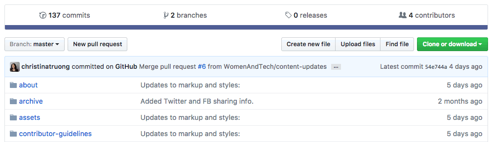

**Step 2:**   
Back in SourceTree, select **File > New** from the main menu.

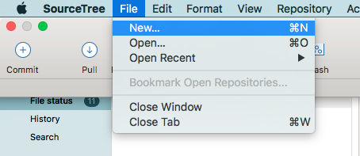

OR

Select **+New** from the Repository Browser.

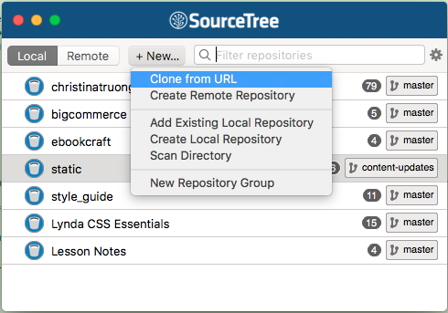

**Step 3:**   
Select a **Destination Path** for your *local* copy. Make sure the folder is empty.
Select the button with the ellipsis to change the destination path. You can name it anything you want in the **Name** field or just leave it the same as the repo name.

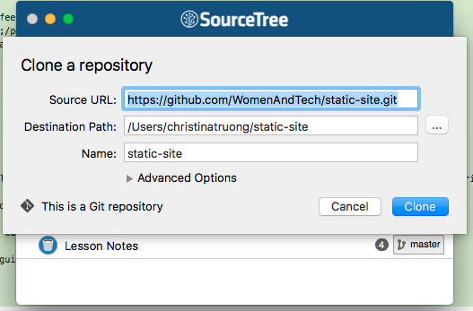

 

## Understanding the Github flow
Below are specific instructions for getting the latest files, adding content and pushing your changes to the site using SourceTree.

If you'd like a general overview of how the Github workflow works, [check out this guide](https://guides.github.com/introduction/flow/).

## Working with Branches

Every Git repository has a **master** branch by default. This is generally considered to be the final version or the "good copy". 

**IMPORTANT**: For the Women&&Tech site, any commits added to the **master** branch are **automatically pushed live to the site.**  Do not add updates directly to the master branch.

Instead, create a branch for each new feature you add (e.g. new interview, new page, content revisions). Give the branch a descriptive name like `firstname-lastname` for a new interview, or `new-about-page` for updates to the About page.

This will give you a separate area to work in and test your updates before it goes live. You can even work with other team members and collaborate on the same branch.
 
 

### Create a new branch
[ still need to add :( ]

 

### Add an existing branch
If another team member has already created a branch and you'd like to work on that branch as well, you'll need to add the *remote* branch.

To add a branch to your local copy:

* Make sure you don't have any modified files (yellow icon with ellipsis).
* `commit` any modified files or temporarily remove them by using the [stash](https://confluence.atlassian.com/sourcetreekb/stash-a-file-with-sourcetree-785332122.html) option.
* Untracked files are ok. (purple icons with a question mark)

Go to **remotes > origin** and expand it  
Right-click on 'branch-name' and select 'Checkout...'

'content-updates' is used for these example but replace that with the name of the branch you want to checkout.

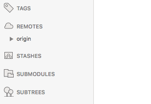

"Checkout" means you are switching over to that branch. The changes you make in this branch does not affect the **master** branch.

Leave the default settings and select OK.

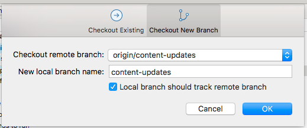

Once complete, you will see the branch name under *your* **BRANCHES**, highlighted with bold text and a circle to the left. **REMOTES** are the branches in the github repo, hosted on github.com.

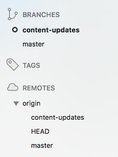

Remote = live on github.com  
Local = the copy on your computer

Make your content updates and commits in your branch until you're ready to push it live to the Women&&Tech site. Check that the branch name is highlighted in SourceTree to ensure that you are in your feature branch, instead of the master branch.

### Working with multiple branches

You can work on several branches at the same time. There is no limit. 
"Checkout" means to switch to any branch, whether it's a temporary feature branch or the master branch.

To switch over to any branch, make sure you don't have any modified files. Same rules as when you were adding an existing branch.

Select **branch-name**, right-click, then **checkout branch-name**.

 

## Adding changes

After making changes to your files, **commit** your changes to the files. 

Go to your **File status** area.  The files that you have modified in some way (deleted, changed, renamed or new file) are the  **Unstaged files**. The revisions have not been push up to the repo yet.

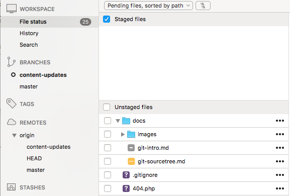

Yellow icons are modified files. This files exist in the repo and you have made changes to them.  
Purple icons indicate untracked files, which are files that have not yet been added to the repo.  
Gray icons are deleted files.

Renamed files will show twice, as a deleted and new file.

Move the unstaged files to the **Staged files** area by selecting the checkbox.  To remove a file from the staged area, uncheck the checkbox. You don't have to commit all your files at once.

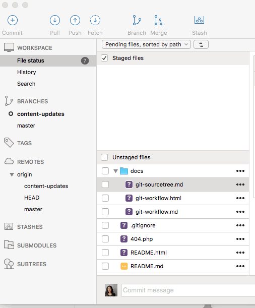

### Add a commit message & push

Clicking inside the text area field at the bottom of app. Leave a descriptive message. This is what will be saved in the repo along with your changes. Then **push** to add your updates to the github repo so other team members using the branch can pull your changes into their local copy.

Select the "Push changes immediate to origin/your-branch-name" option. If it says "origin/master" you are in the master branch. Make sure you're in the right one first before committing!

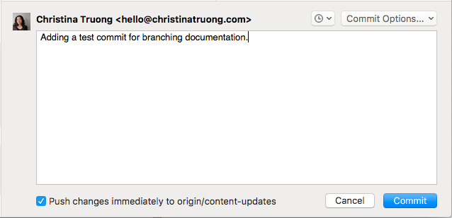

 

If you want to just commit a change but push later, just uncheck the "Push changes immediate to origin/your-branch-name" option. All "unpushed" commits will show in a notification at the top fo the app. You can push from here and make sure you have the right branch selected.

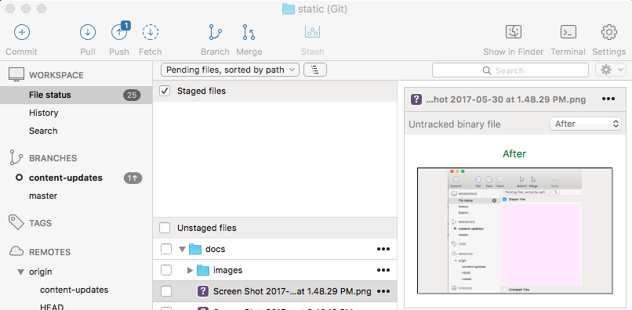

 

## Staying up to date
After you add the branch or repo, you will need to do a **pull** to get any updates added *after* you cloned a copy.  It doesn't matter if you do it before you make changes or after but it needs to be done before you **push** a commit.

In the SourceTree app, if there have been updates added to the repo, you will see a notification on the Pull button. If you don't see any notifications, that means there were no updates. Sometimes there is a delay and you may see the notifications a few minutes after an update was added to the repo. You'll also see the notification under **BRANCHES**.

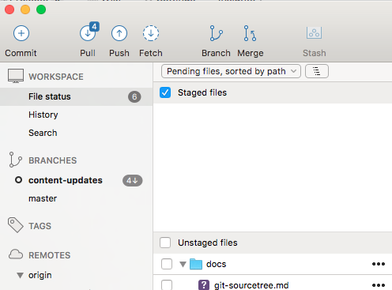

Select the **Pull** button and commit merged changes to bring the updates from the *remote* branch into your *local* branch.

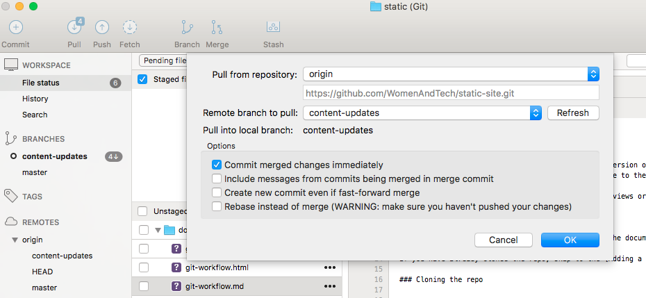

 

## Merge updates to the live site

Updates made to the feature branch are only shared between team members. To add your changes to the live site, you will need to **merge** the commits in the feature branch to the **master** branch.

You can do this with the SourceTree app but Github has a more straightforward way of doing it.

### Step 1: Create a pull request
 
Go to the main repo page: https://github.com/WomenAndTech/static-site  
If you've recently added a commit, you'll see the yellow bar. Select the **Compare & pull request** button.   
If you don't see the yellow bar, select the **New pull request** button instead.

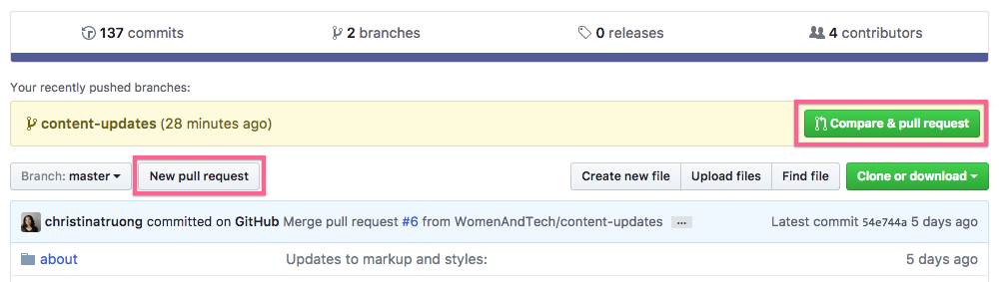

### Step 2: Open a pull request

Here you can review various details before submitting the pull request. Here are some things to look out for:

1.  Make sure the buttons say "base:master" and "compare:your-branch-name" to make sure the feature branch is being merged into the master branch.
2. Check for the "Able to merge" message. This means there are no conflicts to resolve first.
3. Add a commit message. 
4. You can also leave additional comments. Use the @mention method to tag a team member.
5. (Optional) Review the commits that will be added in the merge. Each entry is a link to the commit.
6. (Optional) Review your changes in the box at the bottom of the page.
7. If everything is good, select the "Create pull request" button. This will send your pull request to the master branch for approval. But your changes have **NOT** been added to the master branch yet. It must be approved first.

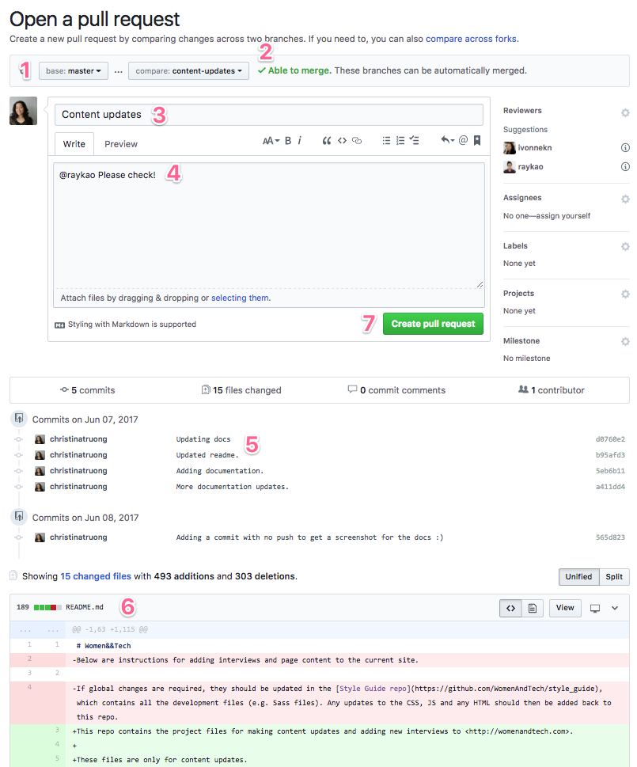

After you create a pull request, you will be automatically taken to the approval screen.

 

### Step 3: Approving a pull request and going live!

You don't have to approve the pull request right and **merge** your branch to the master branch right away. You can always access it later from the **Pull request** tab.

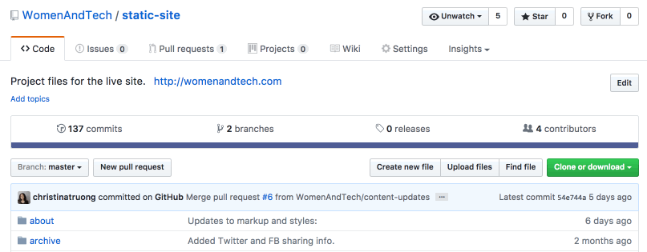

 
**Closing a pull request**   

You don't even have to approve it at all! If you want to approve it, select the **Merge pull request** button. If you decide you don't want to merge the changes into master anymore, you can **Close pull request**.

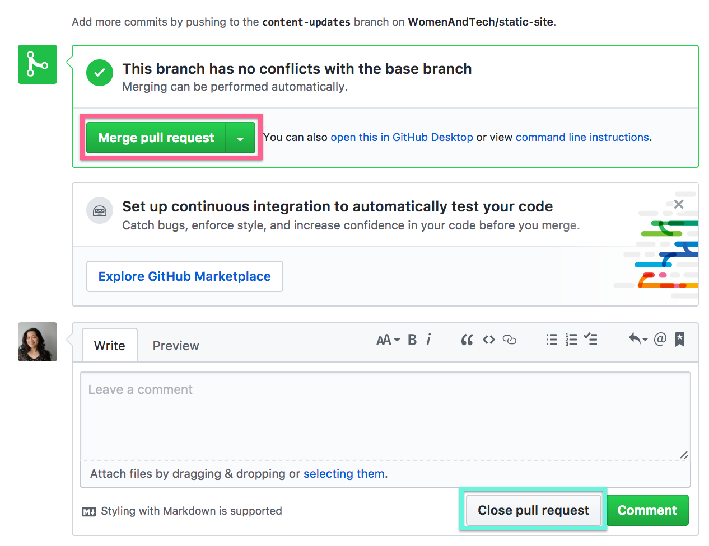

 
**Reopening a pull request**   

Once you close a pull request, you can still access it under the **Pull requests > Closed**.  If you want to use the pull request after all, select the **Reopen pull request** button at the bottom of the screen to reopen it and merge the pull request to the master branch.

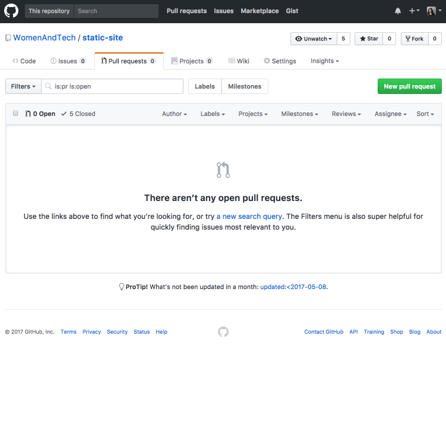

 
**Approving a pull request**

When you're finally ready to push your changes to the master branch and go live, approve the pull request by *merging* the feature branch into the master branch.

In the pull request, you will see  a "Merge pull request" button with the message "This branch has no conflicts with the base branch." This means Git will be able to merge your branch to the master branch with no conflicts between the files.

Go ahead and press the button to **Merge pull request** button!

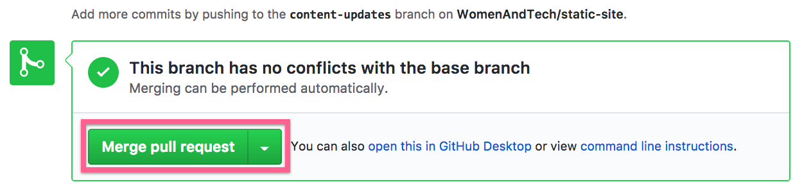

**Merge pull request confirmation**

Once you confirm the merge it will take you to a final screen. You will now see a **Merged** badge in the pull request.

There's also a message at the bottom that says "Pull request successfully merged and closed" and a "Delete branch" option.

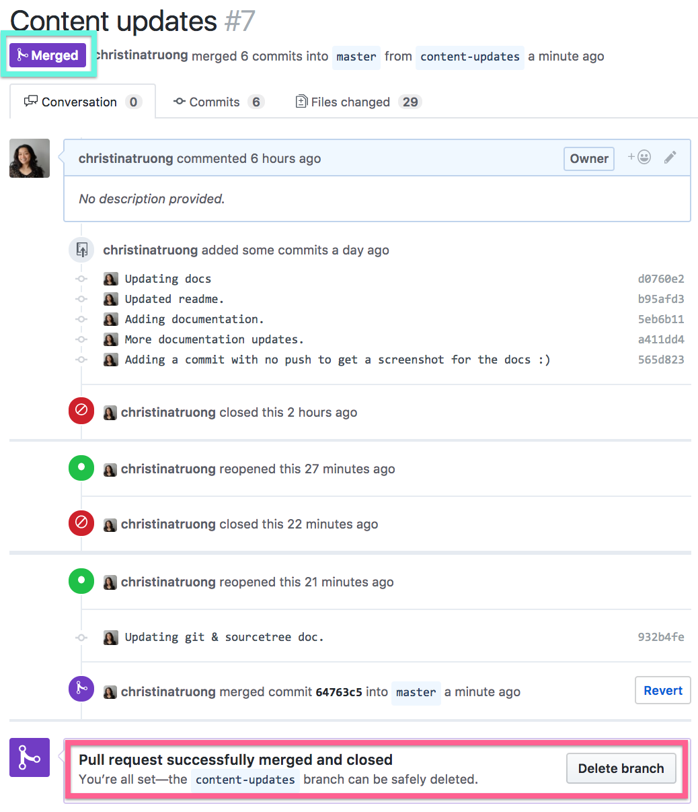

Delete the branch if you're done with it (e.g. added a new interview).
Keep the branch if you plan on continuing to update it (e.g. a dev branch for dev updates).

If you delete the branch and decide you still need it (e.g. revisions to an interview), no worries! Just create a new branch.

Your feature branch revisions are now added to the **master** branch AND the live site!

 

## Keeping the branches in sync

When you merge a pull request from the feature branch to the master branch, all the commits you added to the branch will be added to master, as well as one additional commits to the master branch, the **Merge pull request..."** commit.

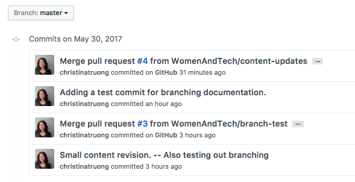

Any commits added to **master** branch will not be automatically added to the feature branch either. 

In theory, you don't really need to use the **master** branch anymore because you'll be making all your updates to your feature branches. 

But, if you want to keep your **master** branch up to date, you can *checkout* your master branch and **pull** the updates.

Just remember to *checkout* the feature branch again before making more revisions.

