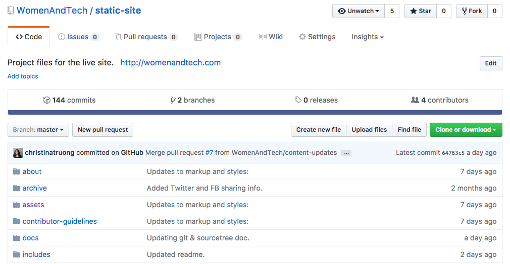

# Working with Git and SourceTree

If you are experienced with Git, use any tool or software you want. Just be sure to follow the same branching workflow as the rest of the team and do not commit any files into the repo that are only required for your tool (e.g. grunt config file).

If you want to work with SourceTree, follow the instructions below.

## Table of contents
- [Getting started](#getting-started)
- [Clone the repo](#clone-the-repo)
- [Understanding the Github flow](understanding-the-github-flow)
- [Working with branches](#working-with-branches)
  - [Master & feature branches](#master-&-feature-branches)
  - [Checkout a branch](#checkout-a-branch)
  - [Git stash](#git-stash)
- [Create a new branch](#create-a-new-branch)
  - [Branching with SourceTree](#branching-with-sourcetree)
  - [Branching with github](#branching-with-github)
- [Add a remote branch](#add-a-remote-branch)
  - [Fetching a branch](#fetching-a-branch)
- [Delete a branch](#delete-a-branch)
- [Working with multiple branches](#working-with-multiple-branches)
- [Add and commit changes](#add-and-commit-changes)
- [Staying up to date](#staying-up-to-date)
- [Pull requests and going live](#pull-requests-and-going-live)
- [Keeping the `master` branch up to date](#keeping-the-master-branch-up-to-date)

<br>

## Getting started

Download the SourceTree app: <https://www.sourcetreeapp.com>  

Follow the installation steps and connect it to your Github account.  You will be required to create a (free) Atlassian account (the creators of SourceTree). You may also be prompted to create a Bitbucket account (another Atlassian product) but it is not required.

You can view more details in the Atlassian [getting started guide](https://confluence.atlassian.com/get-started-with-sourcetree/install-sourcetree-847359094.html).

<br>

## Clone the repo
You only have to do this step once. Cloning the repo will grab the latest files from the Github repository and save it to your computer.

If you have already cloned the repo, skip to the [Working with branches](#working-with-branches) section.

**Step 1:**  
From the [main repository page](https://github.com/WomenAndTech/static-site), select the `Clone or download` button and copy the URL. 

This will either be the SSH or HTTPS URL, depending on how you authenticate to GitHub. If you're not sure how your account is authenticated, use the HTTPS URL.


**Step 2:**   
Back in SourceTree, select **File > New** from the main menu.


OR

Select **+New** from the Repository Browser.


**Step 3:**   
Select a **Destination Path** for your *local* copy. Make sure the folder is empty.
Select the button with the ellipsis to change the destination path. You can name it anything you want in the **Name** field or just leave it the same as the repo name.


<br>

## Understanding the Github flow
Below are specific instructions for getting the latest files, working with branches, adding content and pushing your changes to the Women&&Tech site, using SourceTree.

If you'd like an overview of how the Github workflow works, in general, [check out this guide](https://guides.github.com/introduction/flow/).

<br>
## Working with Branches

### Master & feature branches
Every Git repository has a `master` branch by default. This is generally considered to be the clean copy or the "good copy". The master branch contains all of the production ready files and code and has been tested.

**IMPORTANT**: For the Women&&Tech site, any commits added to the `master` branch are *automatically pushed live to the site.*  Do not add updates directly to the `master` branch. 

Instead, create a branch for each new feature (e.g. new interview, new page, content revisions). This will give you a separate area to work in and test your updates before it goes live. You can even work with other team members and collaborate on the same branch.

Give your branch a descriptive name like `firstname-lastname` for interviews. Or name it after the feature you're working on like `dev-updates` or `about-page-revisions`.

Always create a new branch from `master` because it contains all the current files which are live on the site and have been tested.

### Checkout a branch
In Git, to *checkout* a branch means to switch over to that branch. Your local files will show the current status of that current branch. For example:

```
about-page-revisions -- you made a change to the about page in this branch
pearl-chen -- you added an interview in this branch
```

If you're in the `about-page-revisions` you will not see the new interview and vice versa.  These branches are separate from other branches and the `master` branch.

When switching between branches, here are a few things to note:

* Make sure you don't have any modified files (yellow icon with ellipsis).
* `commit` any modified files or temporarily remove them by using the [stash](#git-stash) option.
* Untracked files (purple icons with a question mark) are ok. 

### Git stash
Stashing files is temporarily removing or hiding the files for later without committing them. If you have changes you don't want to commit yet but you need to *checkout* another branch, you can *stash* the files first, then switch branches. 


When you go back to the branch with the stashed modifications, *apply* the stash to add your modifications back in. You can delete the stash when you apply it by checking the **Delete after applying** or just right-click the item under the **STASHES** menu and delete it from there.
 


<br>
Go to the [Add a remote branch](#add-a-remote-branch) section to get instructions for adding an existing branch to your local copy.   
Or go to the [create a new branch](#create-a-new-branch) section to add a new feature branch. 
 
<br>

## Create a new branch

You can create a branch on github.com or through SourceTree.

### Branching with SourceTree

Always create a new branch from the `master` branch because it contains all the current files which are live on the site and have been tested. Make sure you're in your master branch *first* before creating a new branch. It should be highlighted in SourceTree (bold with a circle). 


If it isn't, double click `master` under **BRANCHES** to *checkout* the  branch OR right-click and select **Checkout master**.


If you have unsaved modified files, you'll see a warning.


If you choose the "Discard local changes" option, Git will delete your modifications. Your other option is to `commit` your changes or [stash](#git-stash) them before checking out the branch.

Once you're in the `master` branch, select the **Branch** icon, add a branch name select **Create Branch**.


<br>
You have now created a *local* branch.  

When you add your first commit, the commit AND the branch will be pushed up to the Github repo and other team members will then be able to see and checkout your feature branch.

<br>

### Branching with Github

Always create a new branch from the `master` branch because it contains all the current files which are live on the site and have been tested.

From the [main repository page](https://github.com/WomenAndTech/static-site), select the **Branch: master** button to create a branch from the master branch. 


<br>
Click to show a dropdown, add a name for your new branch by typing it in the dropdown text field. Then press enter. Once it's created, the Github repository page will automatically switch over to the new branch repo.



<br>
Creating a branch on github.com means you've created a *remote* branch. Go to the next section, and follow the instructions for [adding a remote branch](#add-a-remote-branch) to add your new branch to your local copy.  

<br>

## Add a remote branch
Adding a *remote* branch mean you are making a *local* copy of a branch.

To add a remote branch to your local copy:

* Make sure you don't have any modified files (yellow icon with ellipsis).
* `commit` any modified files or temporarily remove them by using the [stash](https://confluence.atlassian.com/sourcetreekb/stash-a-file-with-sourcetree-785332122.html) option.
* Untracked files are ok. (purple icons with a question mark)

<br>

### Checkout the branch
`Checkout` means you are switching over to that branch. The first time you checkout a remote branch, it gets added to your local and switches over to the branch at the same tiem. The changes you make in this branch does not affect the **master** branch.

* Back in SourceTree, go to **REMOTES > origin** and expand it  
* Right-click on the `branch-name` and select **Checkout...**  
* It will be automatically added to your **BRANCHES** list


Remote = live on github.com  
Local = the copy on your computer

Make your updates and commits in your branch until you're ready to push it live to the Women&&Tech site. Check that the branch name is highlighted in SourceTree to ensure that you are in your feature branch, instead of the master branch.

<br>

### Fetching a branch
If you don't see the remote branch you're looking for, you can *fetch* the updates by right-clicking *origin* under the **REMOTES** section and select **Fetch from origin** OR select the **Fetch** icon from the top menu.


**FYI**  
Git `fetch` grabs updates from the remote repository but does not merge any of the commits.  
Git `pull` does a `fetch` and `merge` in the same step.

A more in-depth discussion can be found in this [Stack Overflow post](https://stackoverflow.com/questions/292357/what-is-the-difference-between-git-pull-and-git-fetch#292359).

<br>

## Delete a branch
There are several ways to delete a branch. 

**Option 1:**  

In SourceTree, under **BRANCHES**, right-click and select **Delete branch-name**. 

Check "Force delete" to delete the branch without checking whether it's been merged into master. Check "Delete remote branch" to delete the remote branch AND local branch in one step.


**Option 2:**   
Delete the branch by selecting the **Branch** icon. This is useful for deleting multiple branches at the same time.


**Option 3:**  
From the main repo page, go to the **branches** link and select the trash can icon.   
*This only deletes your *remote* branch.* 


<br>

When you delete a branch from SourceTree, even if you choose the "Delete remote branch" option, it may still appear under **REMOTES**.

If you delete it under **REMOTES**, you will see "error: unable to delete..." because the remote branch has already been deleted but it will remove it from the list after you close the error message.
<!--  -->


You can also try *fetching* the updates from **origin** again.


<br>

## Working with multiple branches

You can work on several branches at the same time. There is no limit. 
"Checkout" means to switch to any branch, whether it's a temporary feature branch or the master branch.

To switch over to any branch, make sure you don't have any modified files. Same rules as when you were adding an existing branch.

Select **branch-name**, right-click, then **checkout branch-name**.

<br>


## Add and commit changes

After making changes to your files, **commit** your changes to the files. 

Go to your **File status** area.  The files that you have modified in some way (deleted, changed, renamed or new file) are the  **Unstaged files**. The revisions have not been push up to the repo yet.


Yellow icons are modified files. This files exist in the repo and you have made changes to them.  
Purple icons indicate untracked files, which are files that have not yet been added to the repo.  
Gray icons are deleted files.

Renamed files will show twice, as a deleted and new file.


Move the unstaged files to the **Staged files** area by selecting the checkbox.  To remove a file from the staged area, uncheck the checkbox. You don't have to commit all your files at once.


### Add a commit message & push

Clicking inside the text area field at the bottom of app. Leave a descriptive message. This is what will be saved in the repo along with your changes. Then **push** to add your updates to the github repo so other team members using the branch can pull your changes into their local copy.

Select the "Push changes immediate to origin/your-branch-name" option. If it says "origin/master" you are in the master branch. Make sure you're in the right one first before committing!


<br>

If you want to just commit a change but push later, just uncheck the "Push changes immediate to origin/your-branch-name" option. All "unpushed" commits will show in a notification at the top fo the app. You can push from here and make sure you have the right branch selected.


<br>

## Staying up to date

After you clone a repo, you will need to do a `pull` to get any updates added *after* you cloned a copy.  It doesn't matter if you pull before or after you make your revisions, but it needs to be done before you **push** a commit to the branch with the updates.

In the SourceTree app, you will notifications on the **Pull** button. If you don't see any notifications, that means there were no updates. Sometimes there is a delay and it make take a few minutes to see the notifications. There are also notifications under **BRANCHES**.


Select the **Pull** button and commit merged changes to bring the updates from the *remote* branch into your *local* branch.


<br>

## Pull requests and going live

Updates made to the feature branch are only shared between team members. To add your changes to the live site, you will need to **merge** the commits in the feature branch to the `master` branch.

### Step 1: Create a pull request
 
Go to the main repo page: https://github.com/WomenAndTech/static-site  
If you've recently added a commit, you'll see the yellow bar. Select the **Compare & pull request** button.   
If you don't see the yellow bar, select the **New pull request** button instead.


### Step 2: Open a pull request

Here you can review various details before submitting the pull request. Here are some things to look out for:

1.  Make sure the buttons say "base:master" and "compare:your-branch-name" to make sure the feature branch is being merged into the master branch.
2. Check for the "Able to merge" message. This means there are no conflicts to resolve first.
3. Add a commit message. 
4. You can also leave additional comments. Use the @mention method to tag a team member.
5. (Optional) Review the commits that will be added in the merge. Each entry is a link to the commit.
6. (Optional) Review your changes in the box at the bottom of the page.
7. If everything is good, select the "Create pull request" button. This will send your pull request to the master branch for approval. But your changes have **NOT** been added to the master branch yet. It must be approved first.


After you create a pull request, you will be automatically taken to the approval screen.

<br>

### Step 3: Approving a pull request and going live!

You don't have to approve the *pull request* and *merge* your branch to the `master` branch right away. You can always access it later from the **Pull request** tab.


When you're finally ready to push your changes to the master branch and go live, approve the pull request by *merging* the feature branch into the master branch.

In the pull request, you will see  a **Merge pull request** button with the message "This branch has no conflicts with the base branch." This means Git will be able to merge your branch to the master branch with no conflicts between the files.


Go ahead and press the button to **Merge pull request** button!
Your feature branch revisions are now added to the **master** branch AND the live site!

### Merged pull request confirmation

Once you confirm the merge it will take you to a final screen. You will now see a **Merged** badge in the pull request.

There's also a message at the bottom that says "Pull request successfully merged and closed" and a **Delete branch** option.


Delete the branch if you're done with it (e.g. added a new interview).

You can also delete the branch from the **branches** link, located on the repository landing page.


If you delete the branch and decide you still need it (e.g. revisions to an interview), no worries! Just create a new branch.

<br>

### Closing a pull request   

You don't have to approve the pull request. If you want to approve it, select the **Merge pull request** button. If you decide you don't want to merge the changes into master anymore, you can **Close pull request**.


<br>

### Reopening a pull request   

Once you close a pull request, you can still access it under the **Pull requests > Closed**.  If you want to use the pull request after all, select the **Reopen pull request** button at the bottom of the screen to reopen it.


<br>

## Keeping the `master` branch up to date

In theory, you don't really need to use the **master** branch anymore because you'll be making all your updates to your feature branches. 

But, if you are creating a new branch, it needs to be created from the latest version of the `master` branch.

If you want to keep your **master** branch up to date, or you need to make sure it's up to date before you make a new branch, *checkout* the `master` branch first. The **pull** the updates. Just remember to *checkout* the feature branch before making revisions!!!


